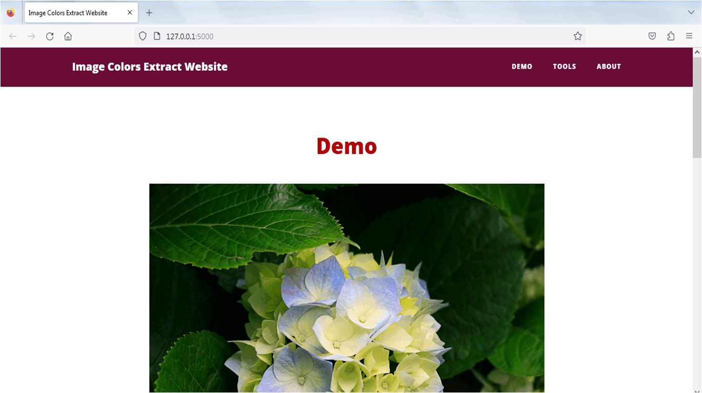

# 
 Image Colors Extract Website 

<h1 align="center">Colour Palette Generator</h1>
<h2 align="center">Applied Data Science in Image Processing </h2>
<h2 align="center">This website is a version inspired on 
<a href="http://www.coolphptools.com/color_extract#demo">coolphptools</a>
</h2>

<h2 align="center">
  
</h2>

<h2 align="center">Image colors extraction by two versions </h2>

<h2 align="center">
  
</h2>

<h2 align="center">
  
</h2>